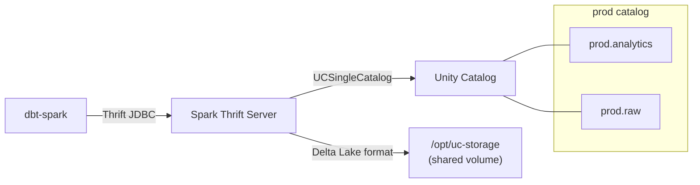
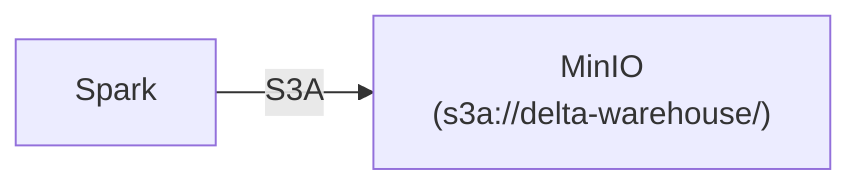

# Delta Analytics Engineering Template

Delta Lake analytics stack for analytics engineer take-home tests. Spark + Delta + Unity Catalog + dbt, with UV for Python dependency management and sqlfluff for SQL linting.

## Stack

| Component | Purpose |
|-----------|---------|
| Spark 4.1 + Delta 4.3 | SQL engine + table format |
| Unity Catalog OSS | 3-level namespace catalog (Databricks-style governance) |
| Spark Thrift Server | JDBC endpoint for dbt-spark |
| dbt-spark | Transformations (Delta format, merge strategy) |
| MinIO (optional) | S3-compatible object storage for raw data |
| UV | Python dependency management |
| sqlfluff | SQL linter (sparksql dialect, dbt-aware) |
| just | CLI command runner |

## Quickstart

### 1. Install UV + just

```bash
# UV — Python package manager
curl -LsSf https://astral.sh/uv/install.sh | sh

# just — command runner
curl --proto '=https' --tlsv1.2 -sSf https://just.systems/install.sh | bash -s -- --to ~/.local/bin
```

### 2. Install Python dependencies

```bash
just setup
# or: uv sync
```

### 3. Start the Docker stack

```bash
cp .env.example .env.local
just infra-up
```

Unity Catalog starts first, then `uc-init` bootstraps the `prod` catalog with `analytics` and `raw` schemas. Spark Thrift Server is ready when the `spark` container healthcheck passes (~120s on first run — Maven downloads Delta + UC jars).

To also start MinIO for raw data landing:

```bash
just up-minio
```

### 4. Run dbt

```bash
just seed      # load fixture data into prod.raw
just debug     # verify Thrift connection
just run       # build models into prod.analytics
just test      # run tests
just docs      # generate + serve docs
```

### 5. Lint SQL

```bash
just lint      # check SQL style
just fix       # auto-fix violations
```

### 6. Full verification (requires Docker)

```bash
just verify    # static checks + compose validation + seed/run/test
```

### 7. Static CI check (no Docker needed)

```bash
just ci        # dbt parse + sqlfluff lint
```

## Available commands

Run `just` to see all recipes:

| Command | Description |
|---------|-------------|
| `just setup` | Install Python deps via UV |
| `just infra-up` | Start Docker stack + wait for healthchecks |
| `just up-minio` | Start with MinIO storage |
| `just down` | Stop Docker stack (preserve volumes) |
| `just clean` | Stop Docker stack + delete volumes |
| `just compose-check` | Validate compose syntax (no Docker needed) |
| `just smoke` | UC API + dbt connection check |
| `just seed` | Load fixture data into `prod.raw` |
| `just debug` | Verify Thrift connection |
| `just run` | Build models into `prod.analytics` |
| `just test` | Run data tests |
| `just docs` | Generate + serve docs |
| `just lint` | Check SQL style |
| `just fix` | Auto-fix SQL violations |
| `just parse` | Parse dbt project (syntax check) |
| `just ci` | Static CI: parse + lint (no Docker) |
| `just verify` | Full end-to-end: static + compose + runtime |

## Architecture



Optional MinIO for raw data landing:



### Unity Catalog integration

Spark uses `UCSingleCatalog` as the `prod` catalog — unqualified table names resolve to `prod.analytics.*`, same as Databricks:

```properties
# spark/conf/spark-defaults.conf
spark.sql.extensions             io.delta.sql.DeltaSparkSessionExtension
spark.sql.catalog.spark_catalog  org.apache.spark.sql.delta.catalog.DeltaCatalog
spark.sql.catalog.prod          io.unitycatalog.spark.UCSingleCatalog
spark.sql.catalog.prod.uri      http://unity-catalog:8080
spark.sql.defaultCatalog         prod
```

`spark_catalog` (DeltaCatalog) remains available for path-based Delta tables.

### dbt incremental models

Models use `file_format='delta'` and `incremental_strategy='merge'` — these carry over verbatim when switching to `dbt-databricks` for production.

```sql
{{ config(materialized='incremental', file_format='delta',
          incremental_strategy='merge', unique_key='order_id') }}
```

### SQL linting

sqlfluff is configured in `pyproject.toml` with:
- Dialect: `sparksql`
- Templater: `jinja` with dbt builtins (`ref`, `source`, `config`, `var`, `is_incremental`)
- Max line length: 120
- Keywords/functions: uppercase, identifiers: lowercase

### Prod migration

Swap `dbt-spark` for `dbt-databricks` in `profiles.yml`:

```yaml
prod:
  type: databricks
  host: <workspace>.cloud.databricks.com
  http_path: /sql/1.0/warehouses/<id>
  catalog: prod
  schema: analytics
```

Install: `uv add dbt-databricks`

## Version compatibility

| Component | Version |
|-----------|---------|
| Python | 3.11 |
| Spark | 4.1.1 (delta-docker image) |
| Delta | 4.3.0 |
| Unity Catalog | 0.5.0 |
| UC Spark connector | unitycatalog-spark_4.1_2.13:0.5.0 |
| dbt-core | 1.11.x |
| dbt-spark | 1.11.x |
| sqlfluff | 4.x |

Delta ↔ Spark ↔ UC connector pinning is strict. Check these before upgrading:
- https://docs.delta.io/releases
- https://github.com/unitycatalog/unitycatalog/releases

## Project structure

```
.
├── justfile              # CLI commands (just <recipe>)
├── pyproject.toml        # Python deps + sqlfluff config (uv sync)
├── uv.lock               # Locked dependency versions
├── .python-version       # Python 3.11
├── .sqlfluffignore       # Lint exclusions
├── AGENTS.md             # AI agent guidance (testing workflow)
│
├── dbt_project.yml       # dbt project config
├── profiles.yml          # dbt connection profiles
├── models/
│   └── staging/
│       ├── _sources.yml          # Source definitions
│       └── stg_orders.sql        # Sample Delta incremental model
├── seeds/
│   └── orders.csv                # Fixture source data (loaded into prod.raw)
├── macros/
│   └── generate_schema_name.sql  # Custom schema naming (no concatenation)
│
├── infra/                        # Infrastructure config (Docker)
│   ├── docker-compose.yml        # Unity Catalog + Spark + MinIO (optional)
│   ├── spark/
│   │   ├── conf/spark-defaults.conf  # Delta + UC + S3A config
│   │   └── entrypoint.sh             # Thrift Server startup (jar resolution)
│   └── uc/
│       └── conf/server.properties    # UC server config
│
├── .agents/
│   ├── setup            # Orb setup (uv sync + tools)
│   └── resume           # Orb resume (fast check)
└── .env.example         # Environment variables template
```
