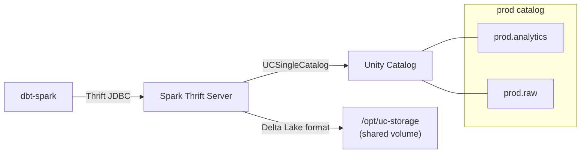

# Delta Analytics Engineering Template

Delta Lake analytics stack for analytics engineer take-home tests. Spark + Delta + Unity Catalog + dbt, with UV for Python dependency management and sqlfluff for SQL linting.

## Stack

| Component | Purpose |
|-----------|---------|
| Spark 4.1 + Delta 4.3 | SQL engine + table format |
| Unity Catalog OSS | 3-level namespace catalog (Databricks-style governance) |
| Spark Thrift Server | JDBC endpoint for dbt-spark |
| dbt-spark | Transformations (Delta format, merge strategy) |
| MinIO (optional) | S3-compatible object storage for raw data |
| UV | Python dependency management |
| sqlfluff | SQL linter (sparksql dialect, dbt-aware) |
| just | CLI command runner |

## Quickstart

### 1. Install UV + just

```bash
# UV — Python package manager
curl -LsSf https://astral.sh/uv/install.sh | sh

# just — command runner
curl --proto '=https' --tlsv1.2 -sSf https://just.systems/install.sh | bash -s -- --to ~/.local/bin
```

### 2. Install Python dependencies

```bash
just setup
# or: uv sync
```

### 3. Start the Docker stack

```bash
cp .env.example .env
just infra-up
```

Unity Catalog starts first (REST API on `localhost:8090`), then `uc-init` bootstraps the `prod` catalog with `analytics` and `raw` schemas. Spark Thrift Server is ready when the `spark` container healthcheck passes (~120s on first run — Maven downloads Delta + UC jars).

To also start MinIO for raw data landing:

```bash
just up-minio
```

### 4. Load raw data and run dbt

Raw data is loaded separately from dbt — simulating a data engineering team
landing source data. Place CSV files in `data/` and load them into `prod.raw`:

```bash
just load-raw  # load CSV files from data/ into prod.raw (see data/README.md)
```

Then run dbt transformations:

```bash
just debug     # verify Thrift connection
just seed      # load dbt seed files into prod.analytics (optional)
just run       # build models into prod.analytics
just test      # run tests
just docs      # generate + serve docs
```

### 5. Lint SQL

```bash
just lint      # check SQL style
just fix       # auto-fix violations
```

### 6. Full verification (requires Docker)

```bash
just verify    # static checks + compose validation + load-raw + seed/run/test
```

`just verify` needs your CSV files in `data/`; it fails at `load-raw` if none
exist. The template ships no sample data and never generates any.

### 7. Static CI check (no Docker needed)

```bash
just ci        # dbt parse + sqlfluff lint
```

### 8. Amp orbs

Orbs use the same Docker Compose workflow. `.agents/setup` installs Docker Engine + the Compose plugin, and `.amp/services.yaml` runs `dockerd` as a supervised orb service (started by `.agents/resume`, or manually with `amp orb services ensure`). `.agents/resume` then waits until `docker info` succeeds (default 8 s, override with `DOCKER_WAIT_TIMEOUT`) and exits non-zero with the service status if it does not. Then run `just verify` as usual.

## Available commands

Run `just` to see all recipes:

| Command | Description |
|---------|-------------|
| `just setup` | Install Python deps via UV |
| `just infra-up` | Start Docker stack + wait for healthchecks |
| `just up-minio` | Start with MinIO storage |
| `just down` | Stop Docker stack (preserve volumes) |
| `just clean` | Stop Docker stack + delete volumes |
| `just compose-check` | Validate compose syntax (no Docker needed) |
| `just smoke` | UC API + dbt connection check |
| `just load-raw` | Load CSV files from `data/` into `prod.raw` (non-dbt) |
| `just query "SELECT ..."` | Run ad-hoc Spark SQL against the running stack |
| `just seed` | Load dbt seed files into `prod.analytics` |
| `just debug` | Verify Thrift connection |
| `just run` | Build models into `prod.analytics` |
| `just test` | Run data tests |
| `just docs` | Generate + serve docs |
| `just lint` | Check SQL style |
| `just fix` | Auto-fix SQL violations |
| `just parse` | Parse dbt project (syntax check) |
| `just ci` | Static CI: parse + lint (no Docker) |
| `just verify` | Full end-to-end with Docker: static + compose + load-raw + seed/run/test |

## Architecture


```mermaid
graph LR
    dbt["dbt-spark"]
    spark["Spark Thrift Server"]
    uc["Unity Catalog"]
    storage["/opt/uc-storage\n(shared volume)"]

    dbt -- "Thrift JDBC" --> spark
    spark -- "UCSingleCatalog" --> uc
    spark -- "Delta Lake format" --> storage

    subgraph "prod catalog"
        prod_analytics["prod.analytics"]
        prod_raw["prod.raw"]
    end
    uc --- prod_analytics
    uc --- prod_raw
```

Optional MinIO for raw data landing:


```mermaid
graph LR
    spark["Spark"]
    minio["MinIO\n(s3a://delta-warehouse/)"]
    spark -- "S3A" --> minio
```

### Unity Catalog integration

#### Unity Catalog hierarchy and terminology

**Unity Catalog OSS** is the metadata and catalog service — the running server process that stores catalog, schema, and table metadata. It is not the same as *a catalog* (an object inside it). One Unity Catalog server can manage multiple catalogs: `prod`, `development`, `finance`, and so on.

Each catalog follows a three-level hierarchy:

```
catalog  →  schema  →  table
```

For example, `prod.raw.orders` means catalog `prod`, schema `raw`, table `orders`. This template boots with one catalog (`prod`) containing three schemas (`default`, `analytics`, `raw`).

Catalogs cannot be created with `CREATE CATALOG` in Spark SQL — the parser rejects it. Instead, a catalog is created in Unity Catalog via its REST API or CLI, then registered in Spark by adding a matching `spark.sql.catalog.<name>` entry to `spark-defaults.conf`. See [Creating additional catalogs](#creating-additional-catalogs) below for the exact steps.

Once a catalog is registered in Spark, schemas and tables inside it can be created and queried with standard SQL (`CREATE SCHEMA`, `CREATE TABLE`, `SELECT`).

#### Spark configuration

Spark uses `UCSingleCatalog` as the `prod` catalog — unqualified table names resolve to `prod.analytics.*`, same as Databricks:

```properties
# spark/conf/spark-defaults.conf
spark.sql.extensions             io.delta.sql.DeltaSparkSessionExtension
spark.sql.catalog.spark_catalog  org.apache.spark.sql.delta.catalog.DeltaCatalog
spark.sql.catalog.prod          io.unitycatalog.spark.UCSingleCatalog
spark.sql.catalog.prod.uri      http://unity-catalog:8080
spark.sql.defaultCatalog         prod
```

`spark_catalog` (DeltaCatalog) remains available for path-based Delta tables.

#### Creating additional catalogs

Spark SQL does not support `CREATE CATALOG` — the parser rejects it. Catalogs must be created via the UC CLI or REST API. Two steps are required:

**Step 1 — Create the catalog in Unity Catalog:**

```bash
# Run against a running stack (just infra-up first)
docker exec infra-unity-catalog-1 \
  bin/uc --server http://localhost:8080 \
  catalog create --name staging \
  --storage_root /opt/uc-storage \
  --comment 'Staging catalog for dev work'

# Verify
docker exec infra-unity-catalog-1 \
  bin/uc --server http://localhost:8080 catalog list
```

**Step 2 — Register the catalog in Spark so it is queryable:**

Add these lines to `infra/spark/conf/spark-defaults.conf`, then restart the stack (`just clean && just infra-up`):

```properties
spark.sql.catalog.staging         io.unitycatalog.spark.UCSingleCatalog
spark.sql.catalog.staging.uri     http://unity-catalog:8080
spark.sql.catalog.staging.token   ""
```

After restart, Spark sees both catalogs:

```sql
SHOW CATALOGS;
-- prod, spark_catalog, staging

-- Schemas can be created from Spark SQL
CREATE SCHEMA staging.raw;
CREATE SCHEMA staging.analytics;
```

### Model materialization — why all models are tables

`dbt_project.yml` sets `+materialized: table` for every model. This is intentional: the current Unity Catalog OSS runtime rejects `CREATE VIEW` with error `MISSING_CATALOG_ABILITY.VIEWS`, so view materialization is unavailable.

This is a limitation of the current UC OSS / catalog runtime setup, **not** a general dbt limitation. dbt fully supports `materialized='view'` when the target catalog provides view support (e.g., Databricks Unity Catalog in production).

Because views cannot be created, staging and intermediate layers in this template also materialize as physical Delta tables. This means extra stored copies and refresh work on every `dbt run` compared with views, which would be computed on demand.

Users moving to a catalog or runtime that supports views may configure staging and intermediate models as views — either per-model via `{{ config(materialized='view') }}` or by overriding the default in `dbt_project.yml`:

```yaml
models:
  delta_analytics:
    +file_format: delta
    +materialized: view          # default for staging/intermediate
    # override back to table for final/incremental models as needed
```

### dbt incremental models

Models use `file_format='delta'` and `incremental_strategy='merge'` — these carry over verbatim when switching to `dbt-databricks` for production.

```sql
{{ config(materialized='incremental', file_format='delta',
          incremental_strategy='merge', unique_key='order_id') }}
```

### SQL linting

sqlfluff is configured in `pyproject.toml` with:
- Dialect: `sparksql`
- Templater: `jinja` with dbt builtins (`ref`, `source`, `config`, `var`, `is_incremental`)
- Max line length: 120
- Keywords/functions: uppercase, identifiers: lowercase

### Prod migration

Swap `dbt-spark` for `dbt-databricks` in `profiles.yml`:

```yaml
prod:
  type: databricks
  host: <workspace>.cloud.databricks.com
  http_path: /sql/1.0/warehouses/<id>
  catalog: prod
  schema: analytics
```

Install: `uv add dbt-databricks`

## Version compatibility

| Component | Version |
|-----------|---------|
| Python | 3.11 |
| Spark | 4.1.1 (`deltaio/delta-docker:4.3.0` image) |
| Delta | 4.3.0 |
| Unity Catalog | 0.5.0 |
| UC Spark connector | unitycatalog-spark_4.1_2.13:0.5.0 |
| dbt-core | 1.11.x |
| dbt-spark | 1.11.x |
| sqlfluff | 4.x |

Delta ↔ Spark ↔ UC connector pinning is strict. Check these before upgrading:
- https://docs.delta.io/releases
- https://github.com/unitycatalog/unitycatalog/releases
