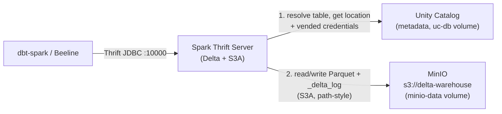

# Delta Analytics Engineering Template

Delta Lake analytics stack for analytics engineer take-home tests, shaped like Databricks: object storage holds the tables, Unity Catalog governs them, Spark computes, dbt transforms. UV manages Python dependencies and sqlfluff lints SQL.

## Stack

| Component | Role |
|-----------|------|
| MinIO (required) | S3-compatible object storage — physically stores every Delta table (`s3://delta-warehouse`) |
| Unity Catalog OSS 0.5.0 | Metadata/catalog service — 3-level namespace, table locations, storage credential vending |
| Spark 4.1 + Delta 4.3 | SQL engine + table format; reads/writes table data in MinIO via S3A |
| Spark Thrift Server | JDBC endpoint for dbt-spark and Beeline |
| dbt-spark | Transformations (Delta format, merge strategy) |
| UV | Python dependency management |
| sqlfluff | SQL linter (sparksql dialect, dbt-aware) |
| just | CLI command runner |

## Quickstart

### 1. Install UV + just

```bash
# UV — Python package manager
curl -LsSf https://astral.sh/uv/install.sh | sh

# just — command runner
curl --proto '=https' --tlsv1.2 -sSf https://just.systems/install.sh | bash -s -- --to ~/.local/bin
```

### 2. Install Python dependencies and create `.env`

```bash
just setup              # or: uv sync
cp .env.example .env    # just loads .env for Docker Compose and dbt
```

### 3. Start the Docker stack

```bash
just infra-up
```

This is the only startup command. It runs `docker compose up -d --build --wait`, which builds the Spark image (first run only) and starts every service in dependency order, returning once all of them are healthy:

1. `minio` — object storage, S3 API on `localhost:9000`, console on `localhost:9001`
2. `minio-init` — creates the `delta-warehouse` bucket (idempotent, exits)
3. `unity-catalog` — catalog server, REST API on `localhost:8090`, configured with MinIO credentials for `s3://delta-warehouse`
4. `uc-init` — creates the `prod` catalog and `default`, `analytics`, `raw` schemas with storage roots in MinIO (idempotent, exits)
5. `spark` — Thrift Server on `localhost:10000`

The first run takes a few minutes: the Spark image build downloads Delta, the Unity Catalog connector and `hadoop-aws` with its AWS SDK bundle. Later starts take about a minute.

### 4. Load raw data and run dbt

Raw data is loaded separately from dbt — simulating a data engineering team landing source data. Place CSV files in `data/` and load them into `prod.raw`:

```bash
just load-raw  # data/*.csv → Delta tables in prod.raw (see data/README.md)
```

Then run dbt transformations:

```bash
just debug          # verify Thrift connection
just seed           # load dbt seed files into prod.analytics (optional)
just run            # build models into prod.analytics
just test           # run tests
just storage-check  # confirm every prod.raw / prod.analytics table is stored in MinIO
just docs           # generate + serve docs
```

### 5. Stop, restart, reset

```bash
just down      # stop containers; tables survive in the minio-data + uc-db volumes
just infra-up  # start again; all tables are still queryable
just clean     # stop and delete all volumes (every table and all catalog metadata)
```

`minio-data` (table files) and `uc-db` (catalog metadata) only make sense together. Never delete one without the other: use `just clean`.

### 6. Lint SQL

```bash
just lint      # check SQL style
just fix       # auto-fix violations
```

### 7. Full verification (requires Docker)

```bash
just verify
```

Runs static checks and Compose validation, starts the stack, loads `data/`, runs `dbt seed`, `dbt run` and `dbt test`, runs `just storage-check`, then restarts the stack and checks raw row counts, `dbt test` and storage again. It tears the stack down **and deletes its volumes** on exit, so run it against a stack whose data you can reload.

`just verify` needs your CSV files in `data/`; it fails at `load-raw` if none exist. The template ships no sample data and never generates any.

### 8. Static CI check (no Docker needed)

```bash
just ci        # dbt parse + sqlfluff lint
```

### 9. Amp orbs

Orbs use the same Docker Compose workflow. `.agents/setup` installs Docker Engine + the Compose plugin and creates `.env`, and `.amp/services.yaml` runs `dockerd` as a supervised orb service (started by `.agents/resume`, or manually with `amp orb services ensure`). `.agents/resume` then waits until `docker info` succeeds (default 8 s, override with `DOCKER_WAIT_TIMEOUT`) and exits non-zero with the service status if it does not. Then run `just infra-up` or `just verify` as usual.

## Available commands

Run `just` to see all recipes:

| Command | Description |
|---------|-------------|
| `just setup` | Install Python deps via UV |
| `just infra-up` | Start the stack (MinIO → UC → Spark) and wait for healthchecks |
| `just down` | Stop the stack (preserve volumes) |
| `just clean` | Stop the stack + delete volumes (all tables and metadata) |
| `just infra-status` | Show container health |
| `just infra-logs` | Tail service logs |
| `just compose-check` | Validate compose syntax (no Docker needed) |
| `just smoke` | UC API + dbt connection check |
| `just load-raw` | Load CSV files from `data/` into `prod.raw` (non-dbt) |
| `just query "SELECT ..."` | Run ad-hoc Spark SQL against the running stack |
| `just storage-check` | Check every `prod.raw` / `prod.analytics` table has its Delta log in MinIO |
| `just minio-ls` | List all objects in `s3://delta-warehouse` |
| `just seed` | Load dbt seed files into `prod.analytics` |
| `just debug` | Verify Thrift connection |
| `just run` | Build models into `prod.analytics` |
| `just test` | Run data tests |
| `just docs` | Generate + serve docs |
| `just lint` | Check SQL style |
| `just fix` | Auto-fix SQL violations |
| `just parse` | Parse dbt project (syntax check) |
| `just ci` | Static CI: parse + lint (no Docker) |
| `just verify` | Full end-to-end with Docker: static + compose + load-raw + seed/run/test + storage + restart |

## Architecture


```mermaid
graph LR
    dbt["dbt-spark / Beeline"]
    spark["Spark Thrift Server<br/>(Delta + S3A)"]
    uc["Unity Catalog<br/>(metadata, uc-db volume)"]
    minio["MinIO<br/>s3://delta-warehouse<br/>(minio-data volume)"]

    dbt -- "Thrift JDBC :10000" --> spark
    spark -- "1. resolve table, get location<br/>+ vended credentials" --> uc
    spark -- "2. read/write Parquet + _delta_log<br/>(S3A, path-style)" --> minio
```

The split mirrors Databricks: **Unity Catalog owns metadata, MinIO owns data.**

- **Unity Catalog** stores catalogs, schemas, table names, columns, and each table's storage location in its H2 database (`uc-db` volume). It never reads or writes table files.
- **MinIO** stores every table's Parquet data files and `_delta_log` (`minio-data` volume). There is no local-disk table storage.
- **Spark** holds no storage keys. For each table, the Unity Catalog connector asks UC for the table location and temporary credentials (credential vending), then reads and writes the files in MinIO through S3A.

### Storage layout

`uc-init` creates the `prod` catalog with storage root `s3://delta-warehouse/prod` and each schema with its own root. Every table created through Spark — `just load-raw`, `dbt seed`, `dbt run` — is a **UC-managed table**: UC allocates its location under the schema root.

```
s3://delta-warehouse/
└── prod/
    ├── raw/__unitystorage/schemas/<schema-id>/tables/<table-id>/         ← prod.raw.*
    │   ├── _delta_log/00000000000000000000.json
    │   └── <prefix>/part-00000-….snappy.parquet
    ├── analytics/__unitystorage/schemas/<schema-id>/tables/<table-id>/   ← prod.analytics.*
    └── default/…                                                          ← prod.default.*
```

Find a table's files:

```bash
just query "DESCRIBE DETAIL prod.raw.orders"   # location column = s3://delta-warehouse/prod/raw/…
just storage-check                              # every raw/analytics table, its location, Delta log + Parquet file count
just minio-ls                                   # raw object listing
```

The MinIO console (`http://localhost:9001`, credentials from `.env`) browses the same bucket.

Storage semantics:

- `DROP TABLE` removes the table from Unity Catalog; Unity Catalog OSS does not delete its files from MinIO. `just load-raw` replaces a table by dropping and recreating it, so old table directories stay in the bucket until `just clean`.
- Data and metadata persist across `just down` / `just infra-up`. `just clean` deletes both volumes together.
- MinIO credentials come from `MINIO_ROOT_USER` / `MINIO_ROOT_PASSWORD` in `.env`. MinIO applies them when the volume is first created; after changing them, run `just clean`.

### Storage credentials

Unity Catalog 0.5.0 vends credentials for `s3://delta-warehouse` from `infra/uc/conf/server.properties`; Compose appends the MinIO keys from `.env` at container start. Unity Catalog cannot call a custom STS endpoint such as MinIO's, so the template uses UC's static-credential mode: a non-empty `s3.sessionToken.0` makes UC vend the configured keys unchanged instead of calling AWS STS `AssumeRole`. Spark is configured with `SimpleAWSCredentialsProvider` and `renewCredential.enabled=false`, so it sends only the vended access and secret keys and ignores the placeholder token.

Consequence: vended credentials are the MinIO root keys, not short-lived, table-scoped credentials as on Databricks. The data path (UC → vended keys → Spark → object store) is the same.

### Unity Catalog integration

#### Unity Catalog hierarchy and terminology

**Unity Catalog OSS** is the metadata and catalog service — the running server process that stores catalog, schema, and table metadata. It is not the same as *a catalog* (an object inside it). One Unity Catalog server can manage multiple catalogs: `prod`, `development`, `finance`, and so on.

Each catalog follows a three-level hierarchy:

```
catalog  →  schema  →  table
```

For example, `prod.raw.orders` means catalog `prod`, schema `raw`, table `orders`. This template boots with one catalog (`prod`) containing three schemas (`default`, `analytics`, `raw`).

Catalogs cannot be created with `CREATE CATALOG` in Spark SQL — the parser rejects it. Instead, a catalog is created in Unity Catalog via its REST API or CLI, then registered in Spark by adding a matching `spark.sql.catalog.<name>` entry to `spark-defaults.conf`. See [Creating additional catalogs](#creating-additional-catalogs) below for the exact steps.

Once a catalog is registered in Spark, schemas and tables inside it can be created and queried with standard SQL (`CREATE SCHEMA`, `CREATE TABLE`, `SELECT`).

#### Spark configuration

Spark uses `UCSingleCatalog` as the `prod` catalog — unqualified table names resolve to `prod.analytics.*`, same as Databricks. S3A points at MinIO:

```properties
# infra/spark/conf/spark-defaults.conf
spark.sql.extensions             io.delta.sql.DeltaSparkSessionExtension
spark.sql.catalog.spark_catalog  org.apache.spark.sql.delta.catalog.DeltaCatalog
spark.sql.catalog.prod           io.unitycatalog.spark.UCSingleCatalog
spark.sql.catalog.prod.uri       http://unity-catalog:8080
spark.sql.catalog.prod.renewCredential.enabled  false
spark.sql.defaultCatalog         prod

spark.hadoop.fs.s3.impl                      org.apache.hadoop.fs.s3a.S3AFileSystem
spark.hadoop.fs.s3a.endpoint                 http://minio:9000
spark.hadoop.fs.s3a.path.style.access        true
spark.hadoop.fs.s3a.aws.credentials.provider org.apache.hadoop.fs.s3a.SimpleAWSCredentialsProvider
```

`spark_catalog` (DeltaCatalog) remains available for path-based Delta tables.

The Spark image (`infra/spark/Dockerfile`) extends `deltaio/delta-docker:4.3.0` and bakes the pinned connector jars into `$SPARK_HOME/jars` at build time. Spark 4.x Thrift Server runs queries in a per-session classloader that does not see `--packages` jars, and baking avoids downloading the AWS SDK bundle on every start.

#### Creating additional catalogs

Spark SQL does not support `CREATE CATALOG` — the parser rejects it. Catalogs must be created via the UC CLI or REST API. Two steps are required:

**Step 1 — Create the catalog in Unity Catalog, rooted in MinIO:**

```bash
# Run against a running stack (just infra-up first)
docker exec infra-unity-catalog-1 \
  bin/uc --server http://localhost:8080 \
  catalog create --name staging \
  --storage_root s3://delta-warehouse/staging \
  --comment 'Staging catalog for dev work'

# Verify
docker exec infra-unity-catalog-1 \
  bin/uc --server http://localhost:8080 catalog list
```

Any location under `s3://delta-warehouse` works: that is the bucket UC holds credentials for.

**Step 2 — Register the catalog in Spark so it is queryable:**

Add these lines to `infra/spark/conf/spark-defaults.conf`, then restart Spark (`just down && just infra-up`):

```properties
spark.sql.catalog.staging         io.unitycatalog.spark.UCSingleCatalog
spark.sql.catalog.staging.uri     http://unity-catalog:8080
spark.sql.catalog.staging.token   ""
spark.sql.catalog.staging.renewCredential.enabled  false
```

After restart, Spark sees both catalogs:

```sql
SHOW CATALOGS;
-- prod, spark_catalog, staging

-- Schemas can be created from Spark SQL
CREATE SCHEMA staging.raw;
CREATE SCHEMA staging.analytics;
```

### Model materialization — why all models are tables

`dbt_project.yml` sets `+materialized: table` for every model. This is intentional: the current Unity Catalog OSS runtime rejects `CREATE VIEW` with error `MISSING_CATALOG_ABILITY.VIEWS`, so view materialization is unavailable.

This is a limitation of the current UC OSS / catalog runtime setup, **not** a general dbt limitation. dbt fully supports `materialized='view'` when the target catalog provides view support (e.g., Databricks Unity Catalog in production).

Because views cannot be created, staging and intermediate layers in this template also materialize as physical Delta tables. This means extra stored copies and refresh work on every `dbt run` compared with views, which would be computed on demand.

Users moving to a catalog or runtime that supports views may configure staging and intermediate models as views — either per-model via `{{ config(materialized='view') }}` or by overriding the default in `dbt_project.yml`:

```yaml
models:
  delta_analytics:
    +file_format: delta
    +materialized: view          # default for staging/intermediate
    # override back to table for final/incremental models as needed
```

### dbt incremental models

Models use `file_format='delta'` and `incremental_strategy='merge'` — these carry over verbatim when switching to `dbt-databricks` for production.

```sql
{{ config(materialized='incremental', file_format='delta',
          incremental_strategy='merge', unique_key='order_id') }}
```

### SQL linting

sqlfluff is configured in `pyproject.toml` with:
- Dialect: `sparksql`
- Templater: `jinja` with dbt builtins (`ref`, `source`, `config`, `var`, `is_incremental`)
- Max line length: 120
- Keywords/functions: uppercase, identifiers: lowercase

### Prod migration

Swap `dbt-spark` for `dbt-databricks` in `profiles.yml`:

```yaml
prod:
  type: databricks
  host: <workspace>.cloud.databricks.com
  http_path: /sql/1.0/warehouses/<id>
  catalog: prod
  schema: analytics
```

Install: `uv add dbt-databricks`

## Version compatibility

| Component | Version |
|-----------|---------|
| Python | 3.11 |
| Spark | 4.1.1 (`deltaio/delta-docker:4.3.0` base image, Hadoop 3.4.2) |
| Delta | 4.3.0 |
| Unity Catalog | 0.5.0 (`unitycatalog/unitycatalog:v0.5.0`) |
| UC Spark connector | unitycatalog-spark_4.1_2.13:0.5.0 |
| hadoop-aws | 3.4.2 (must match the image's Hadoop client) + AWS SDK v2 bundle 2.29.52 |
| MinIO | `pgsty/minio:RELEASE.2026-08-04T00-00-00Z` |
| dbt-core | 1.11.x |
| dbt-spark | 1.11.x |
| sqlfluff | 4.x |

Delta ↔ Spark ↔ UC connector ↔ hadoop-aws pinning is strict. Check these before upgrading:
- https://docs.delta.io/releases
- https://github.com/unitycatalog/unitycatalog/releases

MinIO no longer publishes `minio/minio` images on Docker Hub; the template uses the community-maintained `pgsty/minio` fork, pinned by release tag. Its bundled `mc` client also initializes the bucket.
