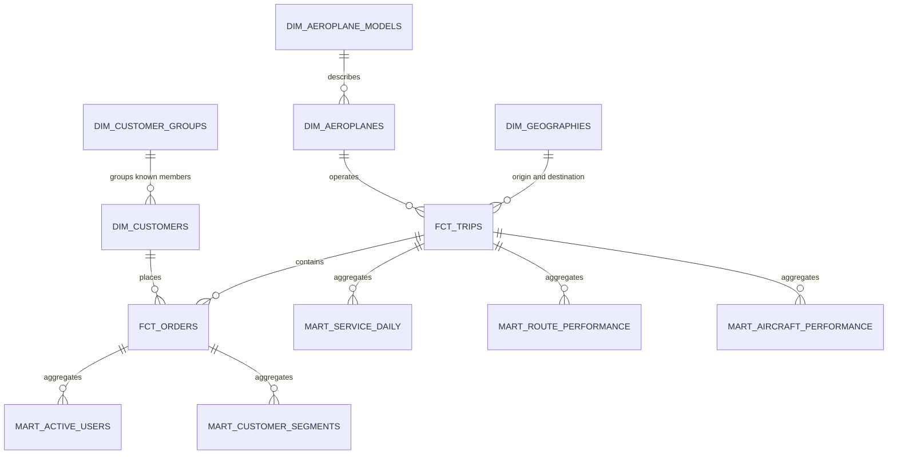

# Air Boltic analytical model

## Purpose and design

This model turns six supplied operational snapshots into tested Delta tables for service, customer, route, aircraft,
order and revenue analysis. It follows the template boundary: files land in `data/`, `just load-raw` creates
`prod.raw` Delta tables, and dbt owns transformations in `prod.analytics`.

The model favors explicit natural keys because every source supplies one and no cross-system identity problem is
present. Staging and intermediate models are views; reusable dimensions, facts and marts are Delta tables. Current
inputs are full snapshots without extraction/update timestamps, so incremental loading and type-2 history would
create false precision. At production scale, add immutable event/ingestion timestamps and source change capture,
then increment facts by those fields and snapshot mutable customers, groups and aircraft.

## Evidence from source profiling

All fields were parsed as CSV, trimmed for profiling, checked for nulls/distinctness, and cross-checked against parent
keys before modeling.

| Dataset | Rows and inferred grain | Keys/relationships | Evidence, nulls and anomalies |
|---|---|---|---|
| `trip.csv` | 20; one scheduled trip per row | `Trip ID` unique/non-null; all 10 `Airplane ID` values valid | 2024-08-01 through 2024-08-28. Start/end values have no timezone. Trips 3 and 9 end earlier than they start when compared as local timestamps, consistent with cross-timezone routes. Duration is therefore not modeled. Twelve trips have no orders. |
| `order.csv` | 20; one seat order per row | `Order ID` unique/non-null; all customer and trip keys valid; active `(Trip ID, Seat No)` pairs unique | One order for each of 20 customers. Statuses: 13 Finished, 5 Booked, 2 Cancelled. Prices are non-null positive integers from €500 to €2,500; total listed value €30,200. No order-created, updated or payment timestamp exists. |
| `customer.csv` | 20; one current customer per row | `Customer ID` unique/non-null | Six group IDs are null, seven match supplied groups, and seven reference absent groups 6-10. Two emails and three phones are null after trimming; customer 18 has neither. Trailing email whitespace is removed in staging. |
| `customer_group.csv` | 5; one current known group per row | `ID` unique/non-null | Types: 3 Company, 1 Private Group, 1 Organisation. Private Group registry number is null. Missing groups referenced by customers are preserved as an explicit unknown segment, not silently repaired. |
| `aeroplane.csv` | 10; one current aircraft per row | `Airplane ID` unique/non-null; every manufacturer/model pair matches specifications | Six models across five manufacturers; each aircraft is used by two trips. Aircraft model repeats are expected inventory behavior. |
| `aeroplane_model.json` / converted CSV | 19; one manufacturer/model specification per row | Model is unique in this extract; all fields non-null | Nine manufacturers. Seat capacity 9-853, weight 13,605-560,000, range 1,554-8,100. Values match conventional aircraft-spec units, so weight is labeled kg and distance nautical miles, but source supplied no unit metadata. See `data/README.md` for conversion fidelity and checksums. |

The raw loader infers types. Staging casts IDs to `BIGINT`, prices to `DECIMAL(18,2)`, model measures to integers, and
trip values to unzoned `TIMESTAMP`. Raw snapshots contain no ingestion timestamp, so dbt source freshness is not
configured: any generated load time would measure this repository run, not source freshness.

## Model dictionary

| Layer/model | Grain and key | Use |
|---|---|---|
| `stg_air_service__*` | Same grain/key as each raw table | Rename, trim, normalize statuses and cast types once. |
| `int_air_service__orders_enriched` | One row per `order_id` | Attach service date, route geography, customer segment and aircraft specification; derive status/value semantics. |
| `int_air_service__trip_order_metrics` | One row per ordered `trip_id` | Aggregate order status, users and values before left-joining to all trips. |
| `dim_geographies` | One row per `city`; key `city` | Curated city-country-region mapping covering every supplied route endpoint. |
| `dim_customers` | One row per `customer_id` | Current profile, known/unknown group membership and segment. Sensitive contact fields remain here, not marts. |
| `dim_customer_groups` | One row per known `customer_group_id` | Current group attributes and observed customer count. |
| `dim_aeroplane_models` | One row per `airplane_model` | Capacity, range, weight, engine and descriptive seat-capacity band. |
| `dim_aeroplanes` | One row per `aeroplane_id` | Current aircraft inventory enriched with model attributes. |
| `fct_orders` | One row per `order_id` | Seat-order economics and conformed customer/route/aircraft dimensions. |
| `fct_trips` | One row per `trip_id` | Supply and order metrics, including trips with no orders. |
| `mart_active_users` | One row per `period_type, period_start` | DAU/WAU/MAU-style active riders, orders, booked GMV and realized-revenue proxy. |
| `mart_service_daily` | One row per service date and directional region pair | Daily regional supply, demand, user, revenue and utilization trends. |
| `mart_route_performance` | One row per directional city pair | Route supply, order economics and utilization. |
| `mart_customer_segments` | One row per segment, membership quality and price band | Segment and price-tier comparison. |
| `mart_aircraft_performance` | One row per manufacturer/model | Aircraft portfolio supply, demand, revenue and utilization. |

## KPI definitions

- **Active user:** distinct customer with at least one `booked` or `finished` order for a trip starting in the period.
  This is active travel/service usage, not login or app engagement.
- **DAU / WAU / MAU:** active-user definition grouped by service date, Monday-start calendar week, or calendar month.
  Periods with no orders are absent because no date spine is supplied.
- **Realized revenue proxy:** sum of `Price (EUR)` for `finished` orders. Finished indicates service outcome, not payment
  settlement or accounting recognition, so this must not be reported as audited revenue.
- **Booked GMV:** sum of price for currently `booked` orders. It excludes finished and cancelled orders to keep status
  buckets mutually exclusive.
- **Cancelled value:** listed price on cancelled orders; not revenue.
- **Active orders / seats:** booked plus finished orders. Each order has one seat number, so the model treats an order
  as one seat. This assumption should be replaced by explicit quantity/passenger data when available.
- **Active seat utilization:** active order count divided by aircraft-model maximum seats. Maximum model capacity may
  differ from an operator's fitted seat map, so this is a capacity proxy.
- **Price band:** descriptive listed-price bands: under €1,000; €1,000-€1,999; €2,000 or more. These are analysis
  buckets, not contractual product tiers.
- **Regional growth:** trends in `mart_service_daily` by origin/destination region. `scheduled_trips` measures supply;
  active users/orders measure served demand; revenue fields measure order value proxies.

## Tests and operating controls

Generic tests cover source/staging/fact key uniqueness, required fields, status/type domains and valid relationships.
Customer-to-group integrity is warning-level because seven bad references are known source evidence. Singular tests
enforce positive prices, manufacturer/model matching, unique active seat per trip, aircraft capacity, exact status
reconciliation, exact revenue bucket semantics, and active-user mart grain.

The city mapping is a small dbt seed because source data supplies city names but no country/region. New cities fail
fact relationship tests until mapped, preventing silent `NULL` regional reporting.

## Assumptions and limitations

1. `Price (EUR)` is listed value for one seat order; taxes, fees, refunds, discounts, operator payouts and FX are absent.
2. Status is a current snapshot. No status history means booking, cancellation and conversion rates over booking time
   cannot be reconstructed.
3. Trip timestamps are local and unzoned. Reliable duration, on-time performance and time-of-day comparison across
   regions require UTC timestamps plus origin/destination timezone identifiers.
4. Coordinates and flown distance are absent. Aircraft maximum range is modeled, but route distance, distance tier,
   passenger-kilometres and share of global aeroplane rides cannot be computed reliably. Add trusted airport codes,
   coordinates and trip distance before publishing those metrics.
5. Origin/destination are city strings, not airports. Multi-airport cities and route identity remain ambiguous.
6. Customer/group/aircraft tables are current snapshots. Historical segment attribution and fleet changes require
   effective timestamps or dbt snapshots.
7. Seven customer group references are unresolved. They remain `Unknown group` so totals reconcile without inventing
   parent records.
8. The dataset is one small August 2024 snapshot. It cannot establish growth, seasonality, retention, market share,
   statistical segment performance or progress toward the 2030 goal; the marts provide structures for future periods.
